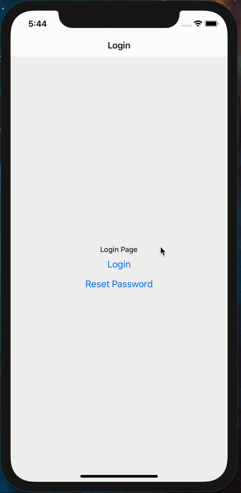
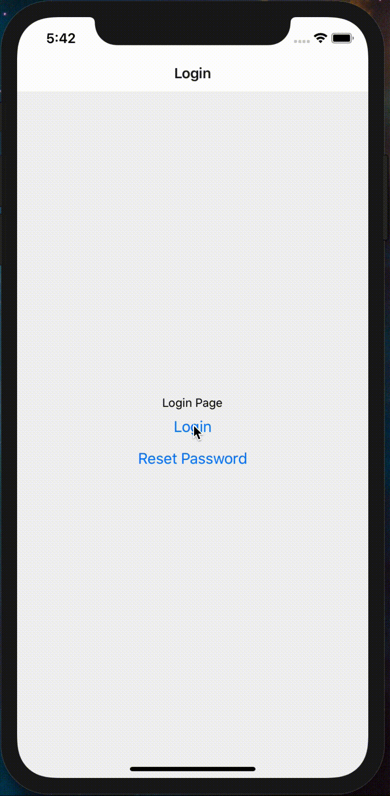

## React Navigation Reset BottomTabNavigator with Custom Navigator

The project represents real case of a problem to reset `BottonTabNavigator` when user logout of the application.

The `BottonTabNavigator` wasn't doing reset the user logged router, When the user logged again, the last router visited on the `BottonTabNavigator` appears.

|              **Actual Behavior**              |              **Expected Behavior**              |
| :-------------------------------------------: | :---------------------------------------------: |
|  |  |

